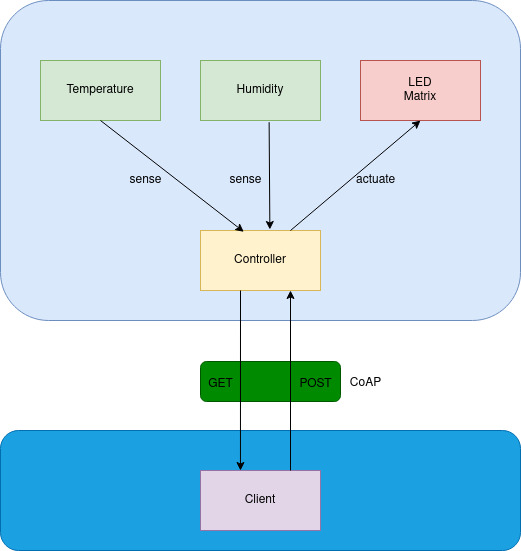
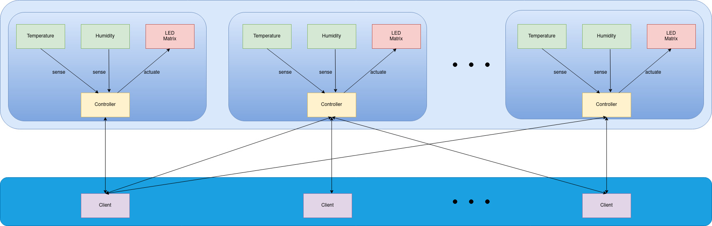

# CoAP Sensors (using SenseHAT emulator)

Constrained Application Protocol (CoAP) is an Internet communication protocol designed to enable communication
with constrained devices, such as IoT sensoring devices.

The present code is a proof of concept that aims to use CoAP as communication protocol to expose and consume sensor data
over the network.

## Two Layers architecture

The code uses a two layer architecture.

In the two layers architecture one is the sensors layer which is composed of the sensors and its controllers and the other
is a client layer which is composed of clients that consume the sensor data.

In this architecture each sensor have a built in controller and each client connects directly to the sensor's controller
to collect its sensor data or to update its thresholds. Each controller may serve multiple clients.

#### Sensors layer

In the sensors layer each sensor have a built in CoAP server (a.k.a. controller) which exposes its sensor data using CoAP
commands to the clients. 

In the proof of concept code each controller exposes two sensor data that can be collected by the clients using GET
CoAP commands.

The two sensor data available are Temperature and Humidity, both emulated by SenseHAT emulator.

The controller also exposes thresholds associated to each sensor data.

These thresholds can be updated by the clients and are used by the controller decide to actuate on a matrix of LEDs
(emulated by SenseHAT emulator) when one of the sensor data is above the configured threshold.

When one of the sensor data is above the threshold the controller lights up the LED matrix using a red color, turning it off otherwise.
 
The controller initial temperature threshold is 24.0º and the initial humidity threshold is 60%.

This values can be configured by each client using POST command or collected using GET commands.

#### Client layer
Each client have two working modes: observer and ad-hoc.

In the observer mode the client connects to a controller (indicated in the command line using '-s' switch) using CoAP
and then starts pooling its data.

The default pooling interval is 2 seconds, but it can be modified by using the '-t' switch in the command line.

Whenever a change in the threshold (made by another client) is detected the client warns its users that can then
change the threshold value back to its own value using the ad-hoc mode.

In the ad-hoc mode, the client connects to the controller indicated in the command line only to collect its sensed data or to update its thresholds.

#### Multiple clients and multiple sensors

This architecture (and the software that proves the concept present in this repository) can easily be used to simulate an environment
with multiple sensors+controllers and multiple clients consuming the sensor data as in the figure below.

## CoAPthon + SenseHAT integration (Proof of Concept)

## Software dependencies

* Python 2.7.16 (already installed in Raspbian Buster)
* CoAPthon 4.0.2

## Execution instructions

* Install dependecies in Raspbian

`$ sudo pip install CoAPthon`

* Clone the repository

`$ git clone https://github.com/diegomachadosoares/CoAPSensors`

* Start the sensor controller in standalone mode

`$ cd CoAPSensors/sensor && chmod +x controller.py && ./controller.py -i 127.0.0.1 -p 5683`

* Execute client commands to get sensor data or update actuator thresholds (using the IP Addresss and port used in the
controller command)

`$ cd CoAPSensors/client && chmod +x client.py && ./client.py -o GET coap://127.0.0.1:5683/temp`

Obs.: The client command may be executed in any remote host indicating the addres of the remote controller in the cli.

#### Example commands

Start the client in observer mode: `$ ./client.py -o OBSERVE coap://127.0.0.1:5683/`

Get current temperature:  `$ ./client.py -o GET coap://127.0.0.1:5683/temp` \
Get current humidity:  `$ ./client.py -o GET coap://127.0.0.1:5683/temp` \
Get current temperature threshold:  `$ ./client.py -o GET coap://127.0.0.1:5683/temp_threshold` \
Get current humidity threshold:  `$ ./client.py -o GET coap://127.0.0.1:5683/temp_threshold`

Set new temperature threashold to 10º: `$ ./client.py -o POST coap://127.0.0.1:5683/temp_threshold -P 10` \
Set new humidity threashold to 30%: `$ ./client.py -o POST coap://127.0.0.1:5683/temp_threshold -P 30`

### Automation
The code also contains a script (2layers.sh) to automate testing the controller and the server.

The script tries to install CoAPthon library using Pythons's PIP package manager.

After installing its dependecies, the script starts one controller and one client.

The client execute multiple commands to retrieve temperature and humidity and also to change the respective thresholds.

This shold be enough to see both layers working.

#### Executing the script

`$ chmod +x 2layer.sh && ./2layer.sh`
